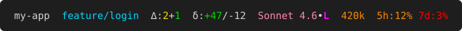

# Claude Code Status Line

A semantic, color-coded [status line](https://code.claude.com/docs/en/statusline)
for [Claude Code](https://code.claude.com/docs).

It turns the status line into a glanceable dashboard: git working-tree state, the
context-window token budget, rate-limit traffic lights, a color per model family so
you see which model the session runs on at a glance, and a clear flag whenever the
effort level is outside your safe set. One Bash script, no build step.



Left to right: directory `my-app`; branch `feature/login` (cyan: not main); 2
modified and 1 new uncommitted file; +47/-12 uncommitted lines; `Sonnet 4.6` in
Sonnet's pink at `low` effort (the `L` flagged in bold magenta); 420k context
tokens (orange: past the warning threshold); 12% of the 5-hour rate limit left
(orange) and 3% of the 7-day one (red).

## Design: one color, one meaning

The palette is organized into four layers so that no single color is overloaded.

| Color | Meaning | Appears on |
| --- | --- | --- |
| orange | approaching a limit (warn) | context tokens, rate limits |
| red | at the limit (critical) | context tokens, rate limits |
| yellow | modified tracked files | `∆` C |
| green | addition: new files, added lines | `∆` N, `δ` +A |
| bold magenta | run configured off the safe default | effort outside the safe set |
| purple | the model is Opus | model |
| pink | the model is Sonnet | model |
| turquoise | the model is Fable | model |
| sky blue | the model is Haiku | model |
| cyan | not on the main branch | branch |
| default | safe / informational | everything else |

"Traffic light" (orange/red) signals a quantitative approach to a hard ceiling.
"Attention" (bold magenta) is a categorical flag that the run is configured off its
safe default. "Identity" (purple, pink, turquoise, sky blue) labels which model
family is running; it is not a judgment, so it stays in regular weight and in hues
that no other layer uses. Everything else is plain information. Keeping these
layers on separate colors is the whole point: a color you see always means the same
thing.

## Segments

| Segment | Shows | Coloring |
| --- | --- | --- |
| `dir` | current directory name | default |
| `branch` | current git branch | cyan when not `main` |
| `∆:C+N` | uncommitted files: C changed (tracked), N new (untracked) | C yellow, N green |
| `δ:+A/-D` | uncommitted line diff of tracked files vs `HEAD` | +A green, -D default |
| `model` | active model | by family: Opus purple, Sonnet pink, Fable turquoise, Haiku sky blue; other models default |
| `•eff` | reasoning effort, attached to the model: `L` low, `M` medium, `H` high, `XH` xhigh, `X` max | bold magenta when not `high`/`xhigh` |
| `NNNk` | context tokens used | orange above 300k, red above 500k |
| `5h` / `7d` | share of the 5-hour / 7-day rate limit left (`100 − used`) | orange below 20% left, red below 5% left |

Segments appear only when Claude Code provides their data:

- `∆` and `δ` are shown whenever the current directory is inside a git repository,
  including `∆:0+0` / `δ:+0/-0` on a clean tree, so the layout stays stable. Lines
  in untracked files are not counted in `δ`.
- `•eff` is shown only for models that support the effort parameter.
- `5h` / `7d` are shown only for Claude.ai Pro and Max subscribers, after the first
  API response of the session.

## Requirements

`bash`, `jq`, `git`, and `awk`. Works on macOS and Linux.

## Installation

Clone the repository:

```sh
git clone https://github.com/al-siv/claude-code-status-line.git
```

Point Claude Code at the script in `~/.claude/settings.json`:

```json
{
  "statusLine": {
    "type": "command",
    "command": "bash /absolute/path/to/claude-code-status-line/statusline.sh"
  }
}
```

Alternatively, run `./install.sh` to copy the script to `~/.claude/statusline.sh`
and print the snippet to add. A different script already at that path is renamed to
`statusline.sh.bak.<timestamp>` first. The copy does not follow the repository:
re-run the installer after `git pull`.

Claude Code reloads settings automatically, so the status line appears as soon as
the file is saved. To preview the output without Claude Code, pipe in sample JSON:

```sh
echo '{"workspace":{"current_dir":"'"$PWD"'"},"model":{"display_name":"Opus"},"effort":{"level":"high"}}' \
  | bash statusline.sh
```

Claude Code re-runs the script on session events such as a new assistant message.
To keep the git counters current while the session is idle, add
`"refreshInterval": 5` (seconds) to the `statusLine` object.

## Configuration

Every threshold is an environment variable with a sensible default. Override it
inline in the command, for example:

```json
"command": "STATUSLINE_CTX_WARN_K=250 bash /path/to/statusline.sh"
```

| Variable | Default | Meaning |
| --- | --- | --- |
| `STATUSLINE_CTX_WARN_K` | `300` | context tokens (thousands) that turn the counter orange |
| `STATUSLINE_CTX_CRIT_K` | `500` | context tokens (thousands) that turn it red |
| `STATUSLINE_RL_WARN_LEFT` | `20` | rate-limit percentage left below which a bucket turns orange |
| `STATUSLINE_RL_CRIT_LEFT` | `5` | rate-limit percentage left below which it turns red |
| `STATUSLINE_SAFE_EFFORT` | `high xhigh` | space-separated effort levels (full names) that are not flagged |
| `STATUSLINE_MAIN_BRANCH` | `main` | branch treated as home (no highlight) |
| `NO_COLOR` | unset | set to any value to disable all coloring (see <https://no-color.org/>) |

## Model colors

The family is found by a case-insensitive match of `opus`, `sonnet`, `fable` or
`haiku` in the model's display name (the label shown in the status line), and, if
that has none, in the model id. A model that matches neither, such as a
third-party model, is shown uncolored.

| Family | Color | 256-color code |
| --- | --- | --- |
| Opus | purple | `38;5;135` |
| Sonnet | pink | `38;5;211` |
| Fable | turquoise | `38;5;43` |
| Haiku | sky blue | `38;5;75` |

The four were chosen to stay clear of every color the other layers use, and of each
other. To change one, edit the `OPUS`, `SONNET`, `FABLE` or `HAIKU` line in the
palette block at the top of `statusline.sh`. The hues are tuned for a dark
terminal background.

## Context token count

The token figure is the input-side context size, taken from Claude Code's
status-line JSON:

```
tokens = input_tokens + cache_creation_input_tokens + cache_read_input_tokens
```

from `context_window.current_usage`, the same formula Claude Code uses for
`used_percentage`. Before the first API call of a session, when `current_usage` is
`null`, the script falls back to `used_percentage / 100 * context_window_size`.

The thresholds are absolute token counts, not a share of the window: past about
300k, and again past 500k, the cost of processing the context grows faster. On
windows of 300k tokens or less the counter therefore never changes color, by design.

## License

MIT — see [LICENSE](LICENSE).
